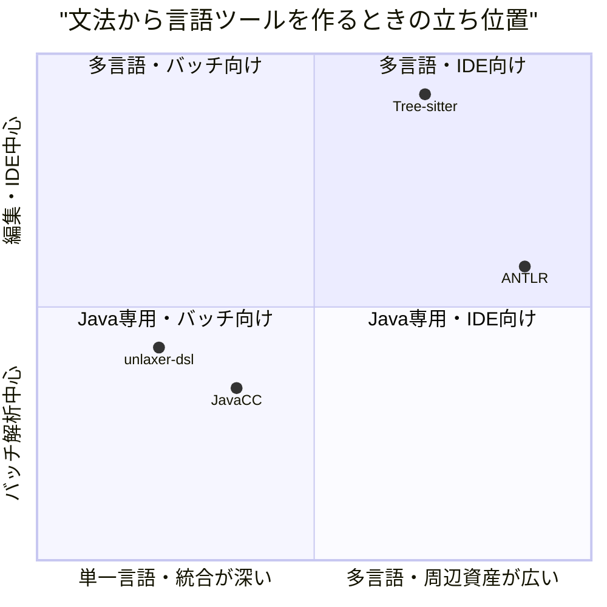
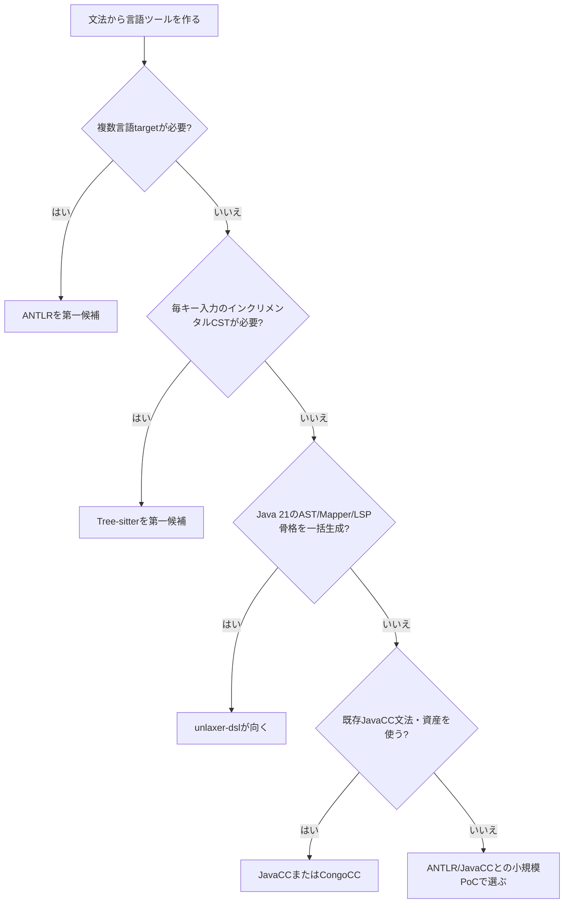

# 0. 要約

立ち位置: UBNFからJavaのParser・AST・Mapper・Evaluatorに加えLSP/DAPの骨格まで生成する、Java専用の生成エンジンである。

最大の弱点: ANTLRの多言語・巨大な利用基盤、Tree-sitterのインクリメンタル解析に対して、採用実績と編集時の性能価値が確認できない。

次の一手: 生成物の再現性・エラー診断・LSPを一つの「最小実用言語ツールキット」として固め、ANTLR/Tree-sitterの代替ではなくJava DSL向けの導入時間で勝つ。

# 1. このrepoは何か

一言でいうと、UBNF（Unlaxer BNF）文法からJavaソースを生成するエンジンである。READMEと`specs/overview.md`、実装を突き合わせると、価値の単位はパーサーランタイム単体ではなく、次の生成パイプライン全体である。

`.ubnf` → Bootstrap parser → Token木 → `UBNFAST` → バリデーション → 8つのJava generator → Javaソース

生成対象は Parser、sealed interface/record AST、Mapper、Evaluator、LSP、LSP launcher、DAP、DAP launcher の8種である。利用者はJavaでDSL・設定言語・小さなプログラミング言語を作る開発者で、生成後のコードを自分のMavenプロジェクトに組み込む。

READMEだけでは「4種類の生成」と読めるが、仕様書と`src/main/java/org/unlaxer/dsl/codegen/`にはLSP/DAPを含む8 generatorがあるため、比較対象はパーサーコンビネータ・ライブラリではなく、文法から言語ツールの土台を生成する製品群とした。

調査時点の客観指標は、Maven artifact version 3.0.11、main Java 35ファイル・約9,475行、test配下109ファイル・約11,336行、公開トップレベル宣言23件である。`mvn test`はローカルMavenキャッシュの`gson/resolver-status.properties`が読み取り専用で失敗し、テスト結果は確認できなかった。生成されたjarは250,039 bytes、sources jarは80,058 bytesだった。

# 1.5. 調査の型

`engine` と判定した。実体はMavenで配布されるJavaライブラリ／CLIであり、文法から複数の成果物を生成する。従って主軸は作品の見た目ではなく、宣言的入力、生成API、状態と再現性、拡張点、診断、生成後のJava統合である。

本調査では比較対象の公開リポジトリと生成器の入口・README・ライセンス・代表的なソースを確認した。ただしネットワーク制約により比較対象をローカルcloneして同一スクリプトで全API数・全依存数を再計測することはできなかったため、4.5節の共通数値比較は限定的であり、confidenceは「中」とした。

# 2. 比較対象と選定理由

| 製品 | 何ができるか | 採用状況 | ライセンス | うちとの決定的な違い | なぜ選んだか |
|---|---|---:|---|---|---|
| ANTLR | 文法からparse tree、listener/visitor、複数言語向けparser/runtimeを生成 | ★19.0k / 最終release 4.13.2 (2024-08-03) | BSD-3-Clause | Java専用の8成果物一括生成ではなく、10言語の一貫した生成基盤 | 同じ「文法→parser＋後処理」の事実上の標準で、最大の代替候補 |
| Tree-sitter | parser generatorとインクリメンタルC runtime、編集途中でも使えるCSTを提供 | ★26.5k / 最終release v0.26.8 (2026-03-31) | MIT | 編集時の高速・壊れにくいCSTが中心で、Java AST/LSP/DAPを直接生成しない | IDE・言語ツール用途で、生成後の利用体験を左右する別系統の標準 |
| JavaCC | Java/C++/C# parser generator、JJTreeによるtree building、action/debugging | ★1.3k / 最終release 7.0.13 (日付の年はページ上で確認できず) | BSD-2-Clause | JavaCC文法と生成parser/treeが中心で、UBNFの型付きAST・LSP/DAP一括生成はない | Javaで直接比較できる既存の文法→コード生成器 |
| JavaCC21/CongoCC | JavaCC系を現代化し、lookahead、INCLUDE、読みやすいJava生成などを拡張 | ★75 / JavaCC21 repoはCongoCCへ移行案内 | BSD系（LICENSE.mdの確認要） | Java 21そのものではなく、JavaCC系の互換・移行と文法機能拡張が中心 | UBNFの設計上の競合になりうるが、継続先が変わったため採用リスクも比較できる |

この市場は寡占に近い。starsではTree-sitterとANTLRがJavaCC系を大きく引き離し、長期採用の安心感と周辺資産が強い。一方、Tree-sitterはCST／編集応答、ANTLRは多言語／汎用parserが主価値で、Java 21の型付きASTからLSP/DAPまでを同じ入力から出す製品は今回の範囲では見つからなかった。この隙間がunlaxer-dslの比較可能な居場所である。

# 3. ポジショニング

軸は、公式READMEの対象言語数・インクリメンタル性・生成対象と、当repoのJava専用／LSP-DAP生成という確認できた特徴から置いた。厳密な性能ベンチマークではないため、位置はカテゴリ比較の概念図である。

# 4. 機能比較

| 機能 | 重み | unlaxer-dsl | ANTLR | Tree-sitter | JavaCC | CongoCC |
|---|---|---|---|---|---|---|
| 文法からparserを生成 | ◎必須 | ○ | ○ | ○ | ○ | ○ |
| Java 21向け生成 | ◎必須 | ○ | △ | × | △ | △ |
| 型付きASTを同一入力から生成 | ◎必須 | ○ | △ parse tree/visitor中心 | △ CST中心 | △ JJTree | △ tree生成 |
| Mapper／Evaluatorの骨格生成 | ◎必須 | ○ | × | × | × | × |
| LSPの骨格生成 | ○効く | ○ | × | × | × | × |
| DAPの骨格生成 | △あれば | ○ | × | × | × | × |
| 複数ターゲット言語 | ○効く | × | ○ | △ binding | ○ | △ |
| インクリメンタル解析 | ◎必須（IDE狙いなら） | × | × | ○ | × | × |
| エラー耐性・部分入力 | ○効く | △仕様上の診断あり、実測未確認 | ○ | ○ | △ | △ |
| grammar include／再利用 | ○効く | △ | ○ | ○ | △ | ○ |
| 依存の軽さ | ○効く | △ main依存2 | △ runtimeあり | ○ runtimeはdependency-free方針 | △ | △ |
| MIT/BSD系の商用利用 | ◎必須 | ○ MIT | ○ BSD-3-Clause | ○ MIT | ○ BSD-2-Clause | △ LICENSE確認要 |

最も痛い×は、IDEで毎キー入力を解析するインクリメンタル性である。ただしこれは当repoの現在の主目的（Javaソース生成）からは必須ではなく、LSP生成を製品価値として押し出す場合にだけ◎へ昇格する。逆に、AST・Mapper・Evaluator・LSP/DAPを一入力から揃える○は、ANTLRやTree-sitterのstarsほど派手ではないが、Java DSLを短時間で製品化する利用者には差別化になる。

多言語対応も大きな差だが、Java専用という前提を捨てて追いかけるとANTLRの規模競争になる。重みを付けると、まず埋めるべきなのは言語数ではなく、生成成果物の安定性、診断、IDE統合の実用化である。

# 4.5. コード・実装の比較

| 観点 | unlaxer-dsl | ANTLR | Tree-sitter | JavaCC | 出典 |
|---|---:|---|---|---|---|
| main実装のJavaファイル数 | 35 | 未集計 | Rust/C/Cの複数crate（未集計） | 未集計 | 当repo `find`; 各公式repo構成 |
| main Java行数 | 9,475 | 未集計 | — | 未集計 | 当repo `wc -l` |
| 公開トップレベル宣言数 | 23 | 未集計 | — | 未集計 | 当repo `rg` |
| main依存数 | 2 (`unlaxer-common`, `vavr`) | runtime/toolで分離（数値未集計） | runtimeはdependency-free方針 | Maven/Ant構成（数値未集計） | `pom.xml`; 各README |
| jarサイズ | 250,039 bytes | 未取得 | — | 未取得 | `target/*.jar` |
| 代表的な生成API | `CodeGenerator.generate(GrammarDecl)` | tool→target templates→runtime | grammar→generated parser→runtime | `javacc` entrypoint→generated parser | `specs/generators.md`; 公式ソース |
| テスト実行 | 環境エラーで未完了 | 公式repoにtool/runtime testsuiteあり | `test/fixtures`あり | `test`あり | 公式repo構成、実行ログ |

コードを読むと、unlaxer-dslは生成器を共通`CodeGenerator`に揃え、入力を`GrammarDecl`、出力をソース文字列の`GeneratedSource`に閉じ込めている。この統一は、ANTLRの多言語targetやTree-sitterのランタイム性能とは別の、Java成果物を束ねる設計上の強みである。一方、比較対象の全体コードを同一環境でclone・ビルドできなかったため、API数・依存数・配布サイズの横並びは未集計であり、そこから優劣は主張しない。

ANTLRの`tool`がtemplatesと複数targetを持ち、JavaCCの`Main`が多数の生成オプションをCLIで扱い、Tree-sitterが`generate` crateとdependency-free runtimeを分離していることは、実装方針の違いとして確認できる。unlaxer-dslはまだBootstrap parserが手書きで、セルフホスティング未完了という実装上のリスクがある。

# 5.5. 調査者の見立て

本当の勝負所は「8種類の生成物の数」ではなく、UBNF一枚から型安全なJavaコードとIDE接続点まで壊れずに出せることだと思う。ANTLRに対して機能数で勝つのではなく、Java 21／sealed record／Mavenに最短で接続できる体験を磨くべきである。

数字に出ていない懸念は、LSP/DAP generatorが実際の言語開発でどこまで使える品質か、そして未完了のセルフホスティングが保守コストを増やさないかである。仕様には未反映のアノテーションもあり、生成対象が多いほど「全部あるが全部浅い」リスクがある（推測）。

自分なら、次は新しいgeneratorを増やさず、TinyCalcからLSPまでの一つの完成例、生成差分の決定論性、診断位置の正確さ、Maven/VS Code導入手順を製品の中心にする。これならTree-sitterの性能競争やANTLRの多言語競争を避けられる。

この見立てが外れるのは、利用者が実際にはJava DSLではなく複数言語・巨大ファイル・毎キー入力のIDE解析を最優先している場合である。その場合はANTLRまたはTree-sitterを組み合わせる方が合理的で、unlaxer-dsl単体の差別化は弱い。逆にJava 21の型付き成果物を必要とする実利用者が確認できれば、現状のニッチ優位は強まる。

# 6. 提案（優先順）

| 順 | 提案 | 分類 | 根拠 | 最小の一手 | 効きそうな指標 |
|---:|---|---|---|---|---|
| 1 | 「UBNF→Parser/AST/Mapper/Evaluator→LSP」の完成サンプルを一つ製品品質にする | 伸ばす | 4節で当repoだけが一括○ | TinyCalcを実プロジェクト化し、生成ファイル・実行・VS Code接続をCIで検証 | 初回成功までの時間、生成後の手修正行数 |
| 2 | 生成物とエラー診断を決定論的にし、golden testを公開契約にする | 伸ばす | 生成エンジンの採用判断は再現性と壊れ方が重要 | Java 21/Mavenの固定環境で入力→全生成物→差分をCI化 | 同一入力の差分ゼロ率、診断の行列正確率 |
| 3 | UBNFのセルフホスティングと未反映アノテーションを優先的に完了する | 埋める | `specs/overview.md`が未完了・未反映を明記 | Bootstrap parserと生成parserを同じfixtureで突き合わせる | self-hosting率、未実装アノテーション数 |
| 4 | LSPを実装品質まで深掘りし、DAPは利用例が出るまで現状の骨格に留める | 埋める | IDE価値は○、DAPは△で差別化の根拠が弱い | 診断・hover・補完の3機能をTinyCalcで実動確認 | VS Code編集時の診断遅延、機能の実動率 |
| 5 | 多言語target、インクリメンタルparser、ANTLR互換文法を直ちには作らない | やらない | ANTLR/Tree-sitterとの規模競争になり、Java専用の深さを薄める | READMEに非目標と連携方針を明記し、必要なら既存ツールを併用 | 新規依存数、生成器保守負荷、導入時間 |

提案1〜3は、既存の立ち位置を強くしながら、採用前に最も不安な「本当に動くのか」「入力が変わると壊れないか」「自分で自分を処理できるのか」を減らす順である。提案4はLSP/DAPを同じ重さで追わず、利用者が目で確認できるLSPに集中する判断である。提案5をやらないことが重要で、starsを追って機能を広げるより、Java向け生成契約を明確にする方がこの市場で説明しやすい。

# 7. 選択の分岐

この分岐は「自分を選ばない条件」を明示するためのものだ。大規模IDE解析や多言語配布を主目的にする場合、unlaxer-dslを無理に中心へ置く理由は確認できない。

# 8. 出典

| URL | 参照日 | 何の根拠に使ったか |
|---|---|---|
| `README.md`（本repo） | 2026-07-31 | 目的、機能、Quick Start、前提Java/Maven |
| `specs/overview.md`（本repo） | 2026-07-31 | 8 generator、パイプライン、未完了事項 |
| `specs/generators.md`（本repo） | 2026-07-31 | 共通生成API、AST/Parser/Mapper仕様 |
| `pom.xml`（本repo） | 2026-07-31 | version、MIT、依存、Java 21 |
| `src/main/java/org/unlaxer/dsl/codegen/`（本repo） | 2026-07-31 | generator実装、公開宣言数 |
| `https://github.com/antlr/antlr4` | 2026-07-31 | stars、BSD-3-Clause、10 target言語、parse tree/listener/visitor、tool構成 |
| `https://github.com/antlr/antlr4/releases` | 2026-07-31 | 4.13.2 / 2024-08-03 |
| `https://github.com/antlr/antlr4/tree/dev/tool` | 2026-07-31 | generator tool、templates、src構成をコード確認 |
| `https://github.com/tree-sitter/tree-sitter` | 2026-07-31 | stars、MIT、incremental parser、C runtimeのdependency-free方針、crate構成 |
| `https://github.com/tree-sitter/tree-sitter/releases` | 2026-07-31 | v0.26.8 / 2026-03-31 |
| `https://github.com/javacc/javacc` | 2026-07-31 | stars、BSD-2-Clause、Java/C++/C#、JJTree、tree building |
| `https://github.com/javacc/javacc/releases` | 2026-07-31 | 7.0.13 |
| `https://github.com/javacc/javacc/blob/master/src/main/java/org/javacc/parser/Main.java` | 2026-07-31 | CLI entrypoint、334 lines/283 LOC、option生成処理、BSD noticeをコード確認 |
| `https://github.com/javacc21/javacc21` | 2026-07-31 | stars、CongoCCへの移行案内、lookahead/INCLUDE/modern Java生成 |

比較対象のコードは公開ページで入口・生成器ディレクトリ・代表ファイルを確認した。ネットワーク制約で全repoをローカルcloneして共通測定することはできず、未集計値を補わなかった。
